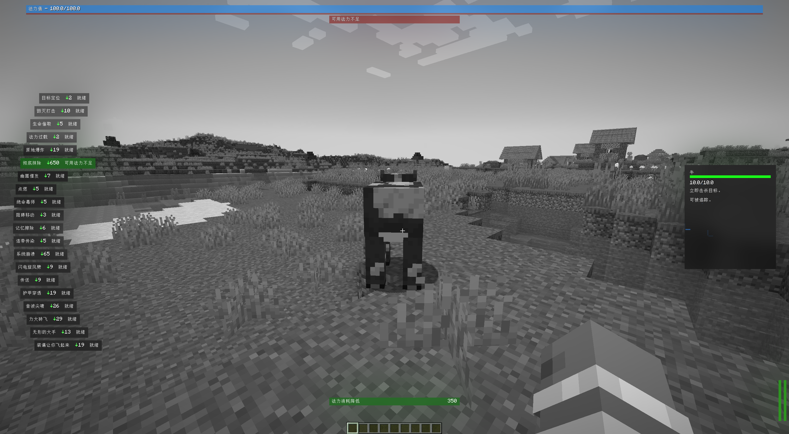

# 扫描界面

<figure><figcaption>
扫描界面
</figcaption></figure>

扫描界面上方是法力值(Mana)和法术状态提示栏，左方是技能列表，右方是信息栏，下方是消耗差异提示。

### 法力值和可用状态

法力值和可用状态在扫描界面上方显示。只要打开扫描界面，法力值就会显示，但如果当前选定的法术可被释放，就不会提示可用状态。

法力值的下方有一个细长的红色条，它是当前法力消耗值，较为直观的提示释放当前法术需要消耗多少法力。

如果选定了目标，且当前法术无法释放，则会显示法术状态提示栏。[magic-available-status.md](detail/magic-available-status.md "mention")

### 技能列表

技能列表由多个技能描述组件组成，从左到右分别是：技能名称，法力消耗，可用状态。

如果法力消耗有所增加或降低，那么在其左侧会有一个绿色或红色的箭头表示。

当前选定的法术以绿色背景显示，无法释放的法术以红色显示，选定了无法释放的法术仍以绿色显示。

### 信息栏

信息栏由目标信息和技能描述组成。

目标信息由目标名称，目标血量条和目标血量数值组成。即可直观的观察目标血量百分比，也可知晓目标有多少血量。

目标信息的下方是技能描述，显示当前选定的技能的介绍。

### 消耗差异提示

如果当前选定的法术的法力消耗有所增加或降低，才会显示消耗差异提示，否则它会被隐藏。

法力消耗的降低/增加会在最左侧显示，具体降低或增加的数值在最右侧显示。如果法力消耗降低了，那么背景以绿色显示，如果法力消耗增加了，那么背景以红色显示。

## 施法

打开扫描界面后，在单人模式下时间会减慢99%（包括自己）以便于瞄准，在这种情况下世界会变成灰白。

不论单人还是多人，辅助瞄准将自动启用，准星将自动吸附到一定范围内的实体。按在屏幕上到准星的距离排序，随后才是你在世界到实体的距离排序。辅助瞄准只会选定可施法的目标。

选定目标后，按下F施法。法术没有冷却时间。

法术开始引导后就不会取消，除非目标死亡。如果玩家在多人模式中退出游戏，法术仍会生效，但可能会受到影响，例如引导生命偷取后退出游戏，法术引导完成时，由于你不在线，无法治疗你，法术就没有效果。
